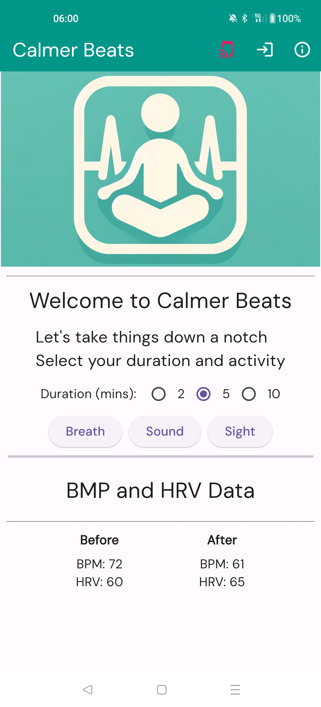

# Calmer Beats (Mark Foster)

App Demo Video:
https://1drv.ms/v/s!ArII0mnkCPeRmJY4FC6w9Vsf4zFKmg
[)]([http://www.youtube.com/watch?v=YOUTUBE_VIDEO_ID](https://1drv.ms/v/s!ArII0mnkCPeRmJY4FC6w9Vsf4zFKmg) "App Demo")
The project aimed to create a Flutter app that can help with the symptoms of anxiety by the user performing focused activities.

## The Concept

Provide an overview of the project concept here. Explain the main idea and the problem it aims to solve.

## Pulse Monitor

The hardware used for this was an SEED Studio ESP32 C3 Super Mini (though any BLE compatable board should work) and the pulse monitor was a MAX30105
The arduino code is stored under the pulseCounter directory in the repo. The code is based on:
 https://github.com/sparkfun/MAX30105_Breakout

BLE Connection Test Video
https://1drv.ms/v/s!ArII0mnkCPeRmJY5tpJGuC-gyJd9ZQ

## The App

### Overview

The app has 3 main activities for the user. A breathing exercise, an observation focus exercise (cloud watching) and a sound focus exersize with woodland sounds.

### Libraries Used

The below libraries were used and added through the CLI to avoid issues.

  firebase_core: ^2.29.0
  go_router: ^13.2.4
  firebase_auth: ^4.19.1
  cloud_firestore: ^4.16.1
  provider: ^6.1.2
  firebase_ui_auth: ^1.13.1
  google_fonts: ^6.2.0
  video_player: ^2.8.6
  just_audio: ^0.9.37
  vibration: ^1.8.4
  permission_handler: ^11.3.1
  flutter_blue_plus: ^1.32.4
  shared_preferences: ^2.2.3

## Getting Started

These instructions will get you a copy of the project up and running on your local machine for development and testing purposes.

### Prerequisites

Make sure your smart phone is in developer mode.

To see and connect to BLE devices, include Bluetooth permissions below in the AndroidManifest.xml file ({app}/android/app/src/main/AndroidManifest.xml)
    <uses-permission android:name="android.permission.BLUETOOTH" />
    <uses-permission android:name="android.permission.BLUETOOTH_ADMIN" />
    <uses-permission android:name="android.permission.BLUETOOTH_CONNECT" />
    <uses-permission android:name="android.permission.BLUETOOTH_SCAN" />
    <uses-permission android:name="android.permission.BLUETOOTH_ADVERTISE" />

### Things to complete

## Installation Instructions
If you're building the code, connect your physical device.
There were quite a few librarbies required and the IDE regularly have issues resolving the libraries. 
If this happens, I found saving your project and using File->Invalidate Caches worked best but ./gradlew clean  and flutter clean also helped from the CLI

##  Contact Details
Mark Foster
ucfnamm@ucl.ac.uk
